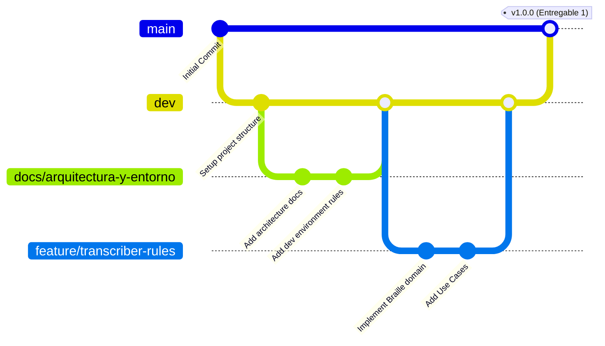

# Ambiente de Desarrollo y Flujo de Trabajo

Este documento establece las normativas de trabajo, herramientas empleadas y nuestro modelo de control de versiones para garantizar un ciclo de vida del software ordenado, estable y profesional, fundamental en la realización y evaluación de este proyecto universitario.

## Herramientas Seleccionadas

- **Control de Versiones:** Git
- **Plataforma de Repositorio:** GitHub
- **Backend:** Python (con framework Flask) / Java (adaptadores paralelos)
- **Frontend:** HTML plano, CSS puro y Vanilla JavaScript. Completamente desacoplado del backend mediante contratos.

## Estrategia de Ramificación (Branching Strategy)

Hemos implementado un modelo de gestión de ramas fundado en un flujo de trabajo que toma inspiración de **GitHub Flow**, adaptándolo fuertemente para cubrir los ciclos de avance y calificación de nuestros entregables.

### Diagrama del Flujo de Ramas

### Detalle de las Ramas

1. **`main` (Producción / Entregable Final)**:
   - Esta rama contiene en todo momento el código estable y las versiones funcionales que serán revisadas del proyecto.
   - 🚨 **REGLA INQUEBRANTABLE:** 🚨 Está **ESTRICTAMENTE PROHIBIDO** realizar commits directos o cualquier tarea de desarrollo directamente en la rama `main`. Cualquier cambio o actualización que deba llegar a `main` debe originarse **única y exclusivamente** de un _Pull Request_ desde la rama `dev`.

2. **`dev` (Integración Continua)**:
   - Se considera la rama núcleo o pivote sobre la cual todos desarrollamos.
   - Es el entorno de integración donde se fusiona y revisa el trabajo proveniente de todas las ramas secundarias (efímeras y de documentación) antes de promoverlas a producción (`main`).

3. **`docs/` (Ramas de Documentación)**:
   - Destinadas netamente a la redacción y revisión del contenido o entregables teóricos.
   - _Ejemplo actual:_ `docs/arquitectura-y-entorno`.

4. **Ramas Efímeras (Trabajo Temporal)**:
   - Tienen un propósito único y una duración específica. Ramifican obligatoriamente desde `dev` y se adhieren nuevamente a `dev` cuando el flujo termina, habitualmente siendo eliminadas posterior al _Pull Request_.
   - **`feature/<nombre>`**: Utilizadas para desarrollar e implementar nuevas funcionalidades al software.
   - **`bugfix/<nombre>`**: Destinadas a la corrección de errores específicos detectados en ambiente de integración o desarrollo.
   - **`test/<nombre>`**: Orientadas puramente a la inclusión y mejora de la parametrización de casos de uso (pruebas unitarias, e2e o de integración continua).

## Resumen del Ciclo de Vida del Desarrollo

1. Se crea o delega una tarea.
2. Un desarrollador origina una rama de tipo `feature/`, `bugfix/` o `test/` desde `dev`.
3. Se desarrolla la lógica en local, realizando commits atómicos.
4. Se crea un _Pull Request_ hacia la rama `dev`.
5. Se efectúa revisión de pares. Una vez validado, se hace _Merge_ en `dev`.
6. Para completar un entregable o cerrar un ciclo de release, se realiza un _Pull Request_ oficial de `dev` a `main`.
