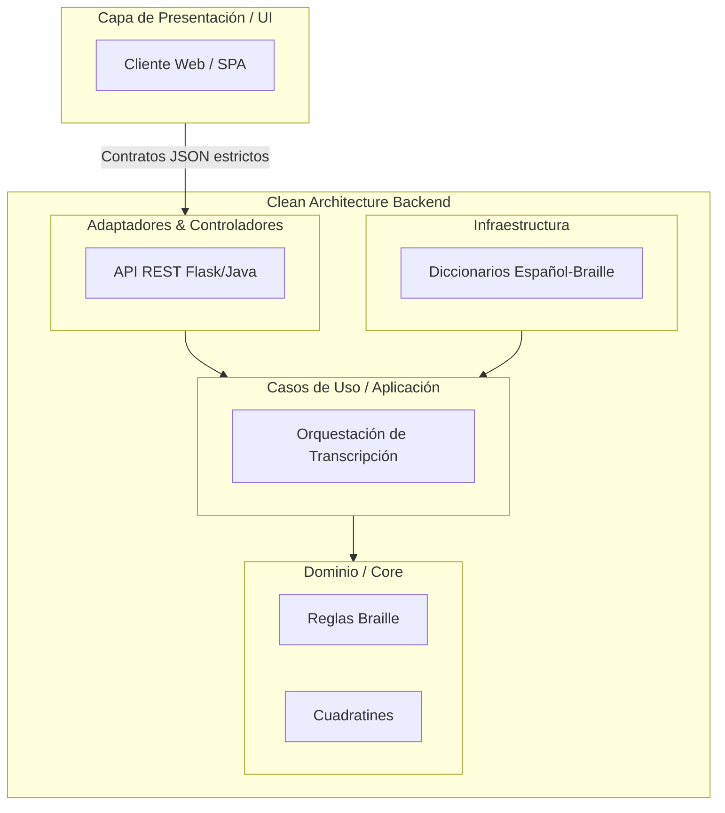
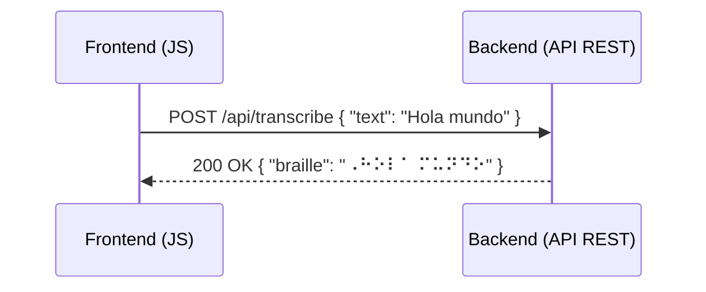

# Diseño Arquitectónico de Alto Nivel

Este documento describe la arquitectura de software de alto nivel para el proyecto del Transcriptor de Español a Braille. La solución ha sido concebida utilizando los principios de **Clean Architecture** (Arquitectura Limpia) para asegurar una alta mantenibilidad, escalabilidad y la total separación de responsabilidades.

## Clean Architecture

La arquitectura se divide en capas concéntricas, donde las reglas de dependencia indican que las capas internas no conocen nada de las capas externas, logrando una independencia total del framework, la interfaz de usuario y las bases de datos.

### Diagrama de Capas

### Capas del Sistema

#### 1. Dominio (Domain)

Es el núcleo de la aplicación. Contiene las reglas puras del Braille, el manejo del símbolo Braille básico y los cuadratines (agrupaciones de puntos). Esta capa es agnóstica de frameworks y servicios externos.

- **Responsabilidades:** Reglas de formación de celdas braille, validación de sintaxis braille, y representación estricta de puntos.

#### 2. Casos de Uso (Application)

Contiene las reglas de negocio específicas de la aplicación. Se encarga de orquestar el flujo de datos desde y hacia la capa de Dominio, manejando la lógica principal.

- **Responsabilidades:** Proceso completo de transcripción de un texto en español al sistema Braille, delegando la lógica al dominio y accediendo a diccionarios a través de puertos/interfaces.

#### 3. Infraestructura (Infrastructure)

Implementa los repositorios (puertos) definidos por los casos de uso. Contiene detalles específicos de acceso a datos locales, archivos o servicios externos.

- **Responsabilidades:** Implementación concreta del diccionario Español-Braille (almacenamiento y consultas en crudo).

#### 4. Adaptadores (Adapters)

Los adaptadores traducen los datos entre el formato estructurado por los Casos de Uso y el formato esperado por agentes externos.

- **Responsabilidades:** Implementación de la API REST (se contemplan implementaciones en Flask o Java). Recibe peticiones HTTP, valida la carga útil y la traslada a los módulos de casos de uso.

## Desacoplamiento de Frontend y Backend

El Frontend y el Backend consisten en aplicaciones **completamente desacopladas** física y lógicamente. Su vía de comunicación es exclusivamente mediante eventos/peticiones sobre la red. Las respuestas de la API están rigurosamente tipadas y ambas aplicaciones se comunican estrictamente a través de **contratos JSON** estandarizados preestablecidos e inmutables.

### Interacción Típica

