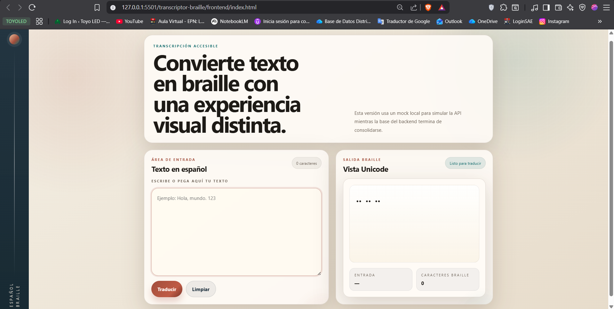
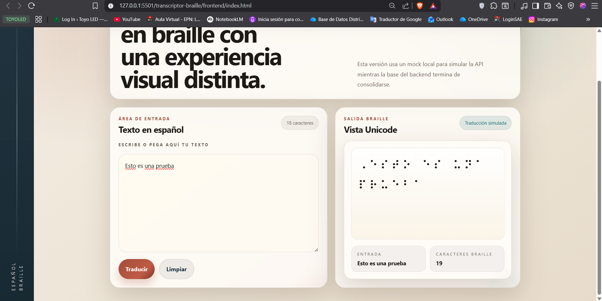
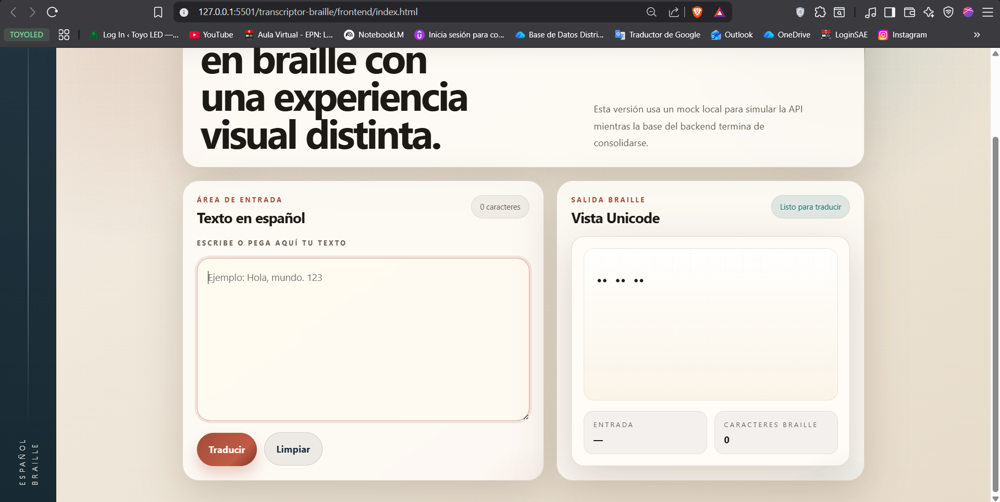

# Manual de Usuario

¡Bienvenido al **Transcriptor de Español a Braille**! Esta aplicación permite traducir de forma instantánea textos escritos en lenguaje español tradicional al sistema Braille.

A continuación, le explicamos cómo utilizar nuestra interfaz de usuario.

---

## 🖥 Conociendo la Interfaz

Al ingresar a la aplicación web, encontrará una pantalla limpia y directa. Las zonas clave son:

1. **Caja de Texto Original:** Área donde usted escribirá o pegará el texto en español.
2. **Botón Traducir:** Ubicado habitualmente en el centro, inicia el proceso de traducción.
3. **Botón de Limpiar:** Permite borrar rápidamente el contenido de ambas cajas de texto.
4. **Caja de Texto Braille:** Área de solo lectura que mostrará el resultado traducido.

---

## 📝 Pasos para Transcribir un Texto

### 1. Ingrese el Texto

Sitúe el cursor o haga clic sobre la **Caja de Texto Original** y escriba el mensaje que desea traducir. Puede incluir letras, números y signos de puntuación admitidos por el sistema Braille.

### 2. Formulación de Transcripción

Una vez esté conforme con su texto, pulse el botón **"Traducir"**.
El sistema enviará de inmediato el texto al procesador y, en fracción de segundos, la traducción aparecerá en el recuadro inferior destinado al Braille.

### 3. Limpiar y Repetir

Si necesita traducir un texto completamente nuevo y desea iniciar desde cero, presione el botón **"Limpiar"**. Esto vaciará automáticamente ambas pantallas de inmediato dejándolas listas para un nuevo uso.

---

### 💡 Recomendaciones Generales

- Se recomienda contar con una conexión estable para garantizar que su petición hacia la API (Backend) no presente retrasos.
- En caso de que el recuadro de validación muestre un error, verifique que ningún símbolo incompatible haya sido introducido.
